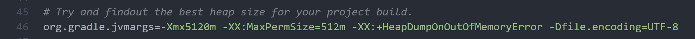
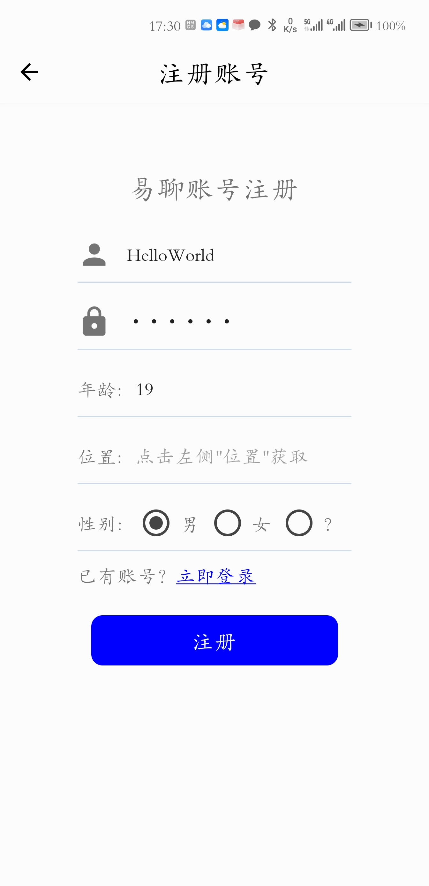
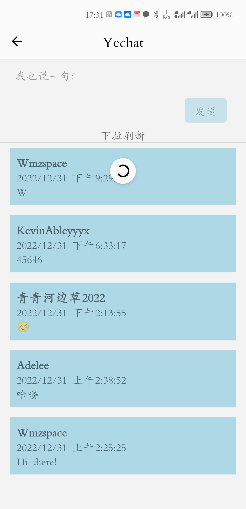

# Yechat 易聊

## *Yechat 项目简介*

### 语言和框架

* Javascript
* typescript
* react-native
* Express
* MySQL
* Ajax
* Nodejs

### 页面文件 (pages目录)

* 首页: home.tsx
* 注册页: signup.tsx
* 登录页: login.tsx
* 聊天主页: main.tsx

### 样式文件

* 全局样式: styles.js

### 入口文件 (Entry file)

* index.tsx

### 配置页

* App.tsx

### 后端文件 (Express)

* serverTemp.js

## *Yechat 调试步骤*

### 克隆该项目到本地

git clone [https://github.com/wmzspace/yechat.git](https://github.com/wmzspace/yechat.git)

### IDEA工作区配置

在根目录下:

yarn install

### 其他依赖项

gradle-7.6

jdk-11.0.16.1

Android API32 （如果有安卓设备，可跳过）

### **环境变量**

GRADLE_HOME: gradle-7.6目录

GRADLE_USER_HOME: .gradle目录

JAVA_HOME, CLASS_PATH: 参见网络教程

ANDROID_HOME: 安卓JDK目录

Path:

%JAVA_HOME%\bin;

%JAVA_HOME%\jre\bin;

%GRADLE_HOME%\bin;

（如果有安卓设备，可忽略以下内容）

%ANDROID_HOME%\platform-tools;

%ANDROID_HOME%\platform-tools;

%ANDROID_HOME%\emulator;

%ANDROID_HOME%\tools;

%ANDROID_HOME%\tools\bin;

### 运行项目

npx react-native run-android

### 注意事项

1. 在IDEA构建gradle项目前，需要修改 android\gradle\wrapper\gradle-wrapper.properties 文件的distributionUrl为你的gradle.zip的存放路径。
2. 如果构建异常，请尝试注释 android\gradle.properties 下图46行代码
3. 可能存在配置异常的文件:
   1. android\gradle\wrapper\gradle-wrapper.properties
   2. android\gradle.properties
   3. android\app\build.gradle
   4. android\settings.gradle
4. 第一次构建gradle项目可能需要30~60分钟

## *成品展示*

